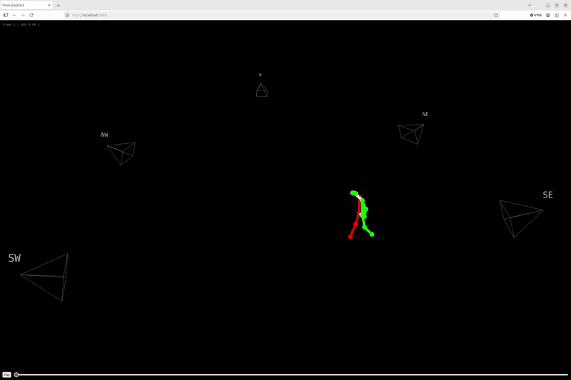

# Local Pose estimation
This repo contains the detection of 2D pose keypoints with yolo11x model and the triangulation of those over multiple views.
It outputs the reprojectionserror for each camera. 
The results can be visualied in your browser on localhost, port 8000.

### Dependencies
> - cv2
> - ultralytics  

> Yolo Model parameter 

## Usage
### Prerequist
Generated synced folder with folder for each nuc and groups.csv. Use `peakCVSyncVid`
### Extract 2d keypoints
```console
python3 detect_2d.py ../peakCVSyncVid/recordings/test/synced 
```
### Triangulate Pose
```console
python3 triangulate.py ../peakCVSyncVid/recordings/test/synced --min-views 3
```
### Visualize
```console
python3 view.py ../peakCVSyncVid/recordings/test/synce
```
